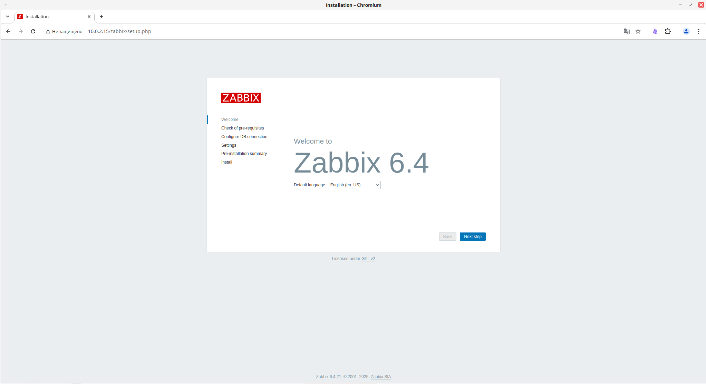
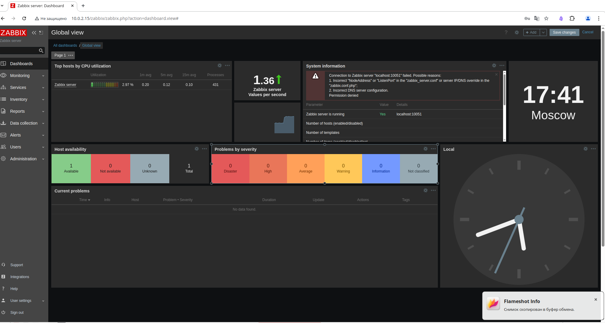
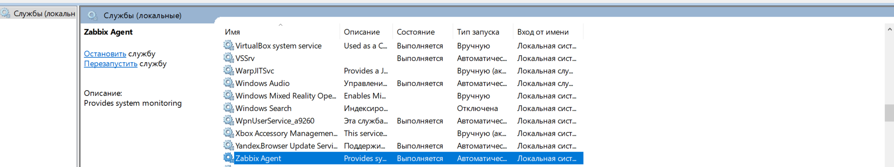
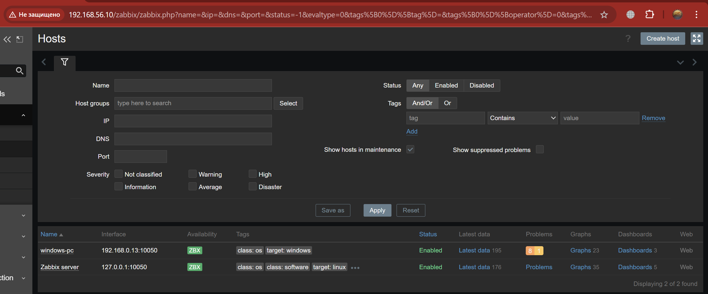
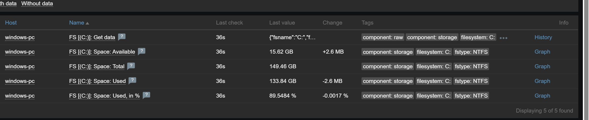

# Домашнее задание к занятию "Система мониторинга Zabbix" - `Зиновьев Михаил`
ОС: Red OS 7.3


### Задание 1  
**Установите Zabbix Server с веб-интерфейсом.**

#### Процесс выполнения
- Выполняя ДЗ, сверяйтесь с процессом, отражённым в записи лекции.
- Установите PostgreSQL. Для установки достаточна версия из системного репозитория Debian 11.
- Пользуясь конфигуратором команд с официального сайта, составьте набор команд для установки последней версии Zabbix с поддержкой PostgreSQL и Apache.
- Выполните все необходимые команды для установки Zabbix Server и Zabbix Web Server.

#### Требования к результатам
- Прикрепите в файл `README.md` скриншот авторизации в админке.
- Приложите в файл `README.md` текст использованных команд в GitHub.

---

### Задание 2  
**Установите Zabbix Agent на два хоста.**

#### Процесс выполнения
- Выполняя ДЗ, сверяйтесь с процессом, отражённым в записи лекции.
- Установите Zabbix Agent на две виртуальные машины, одной из них может быть ваш Zabbix Server.
- Добавьте Zabbix Server в список разрешённых серверов ваших Zabbix Agent’ов.
- Добавьте Zabbix Agent’ов в раздел **Configuration → Hosts** вашего Zabbix Server.
- Проверьте, что в разделе **Latest Data** начали появляться данные с добавленных агентов.

#### Требования к результатам
- Приложите в файл `README.md` скриншот раздела **Configuration → Hosts**, где видно, что агенты подключены к серверу.
- Приложите в файл `README.md` скриншот лога `zabbix-agent`, где видно, что он работает с сервером.
- Приложите в файл `README.md` скриншот раздела **Monitoring → Latest Data** для обоих хостов, где видны поступающие от агентов данные.
- Приложите в файл `README.md` текст использованных команд в GitHub.

---
### Задание 3
**Установите Zabbix Agent на Windows (компьютер) и подключите его к серверу Zabbix.**

Требования к результатам
Приложите в файл README.md скриншот раздела Latest Data, где видно свободное место на диске C:

### Выполнение заданий:
----
## Задание 1. Установка Zabbix Server с веб-интерфейсом (PostgreSQL + Apache)


### 1. Установка PostgreSQL
```bash
sudo dnf install -y postgresql-server postgresql-contrib
sudo postgresql-setup initdb
sudo systemctl enable --now postgresql
```

---


### 2. Создание базы данных и пользователя Zabbix
```bash
sudo -u postgres psql

CREATE USER zabbix WITH PASSWORD 'StrongPassword';
CREATE DATABASE zabbix OWNER zabbix;
\q
```

### 3. Подключение официального репозитория Zabbix
```bash
sudo rpm -Uvh https://repo.zabbix.com/zabbix/6.0/rhel/7/x86_64/zabbix-release-6.0-4.el7.noarch.rpm
sudo dnf clean all
sudo dnf makecache
```

### 4. Установка Zabbix Server + Web + Agent
```bash
sudo dnf install -y \
zabbix-server-pgsql \
zabbix-web-pgsql \
zabbix-apache-conf \
zabbix-sql-scripts \
zabbix-agent
```

### 5. Импорт схемы базы данных
```bash
cd /tmp
zcat /usr/share/zabbix-sql-scripts/postgresql/server.sql.gz | sudo -u zabbix psql zabbix
```

### 6. Настройка Zabbix Server
```bash
sudo nano /etc/zabbix/zabbix_server.conf
```

Изменён параметр:
```bash
DBPassword=StrongPassword
```

### 7. Настройка PHP 
```bash
sudo nano /etc/php.ini
date.timezone = Europe/Moscow
```

### 8. Запуск сервисов
```bash
sudo systemctl enable --now zabbix-server zabbix-agent httpd
sudo systemctl restart zabbix-server httpd
```

### 9. Проверка статусов
```bash
systemctl status zabbix-server --no-pager
systemctl status httpd --no-pager
```

### Админка Zabbix



На Red OS включён SELinux, поэтому для работы веб-интерфейса Zabbix
с PostgreSQL было разрешено сетевое подключение Apache к БД:

```bash
sudo setsebool -P httpd_can_network_connect_db on
```
На Red OS 7.3 доступен PostgreSQL 12.x, а Zabbix 6.4 требует PostgreSQL 13.  
-- Для выполнения учебного задания включена опция:
```bash
sudo nano /etc/zabbix/zabbix_server.conf
```
### Добавлено:
```bash
`AllowUnsupportedDBVersions=1`.
```
sudo systemctl restart zabbix-server

---

## Задание 2. Установка и подключение Zabbix Agent на два хоста

### 1. Установка Zabbix Agent на сервер (Red OS)
```bash
dnf install -y zabbix-agent
```
### Файл: /etc/zabbix/zabbix_agentd.conf

```bash
Server=127.0.0.1
ServerActive=127.0.0.1
Hostname=Zabbix server
```
```bash
systemctl enable --now zabbix-agent
```

### Проверка логов агента 


### 2. Установка Zabbix Agent на Windows

### Файл:C:\Program Files\Zabbix Agent\zabbix_agentd.conf

```cmd
Server=192.168.56.10,192.168.0.0/24
ServerActive=192.168.56.10
Hostname=windows-pc
```

### Перезапуск службы Zabbix Agent.

### 3. Добавление хостов в Zabbix Web

### Путь: Configuration --> Hosts

### Добавлены хосты:
```bash
Zabbix server
windows-pc
```


### Назначены шаблоны:
```bash
Linux by Zabbix agent
Windows by Zabbix agent
```

## Задание 3*. Мониторинг Windows (свободное место на диске C:)

### После назначения шаблона
```Bash
Windows by Zabbix agent
```
в разделе: Monitoring  --> Latest data --> фильтр по filesystem: C:


